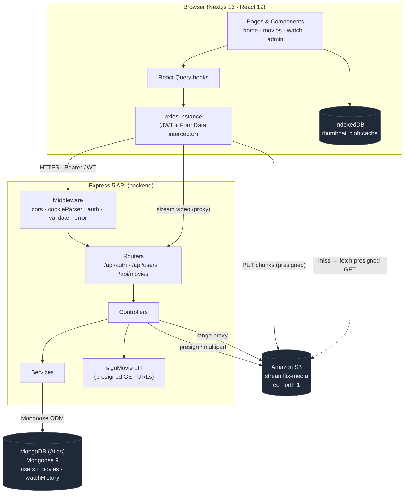
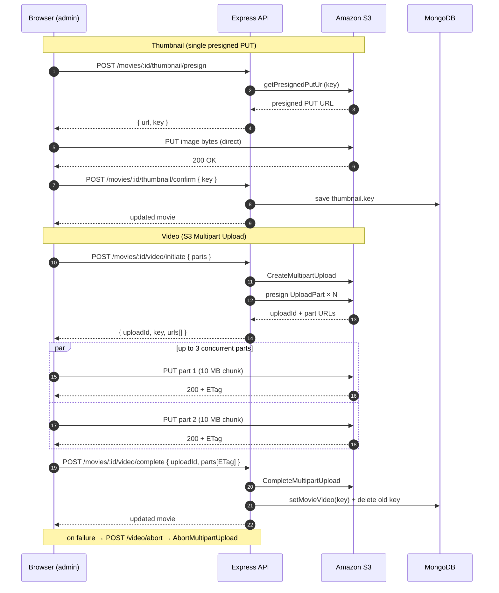
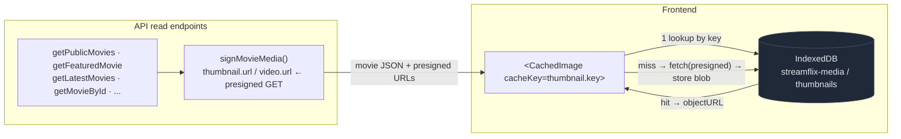
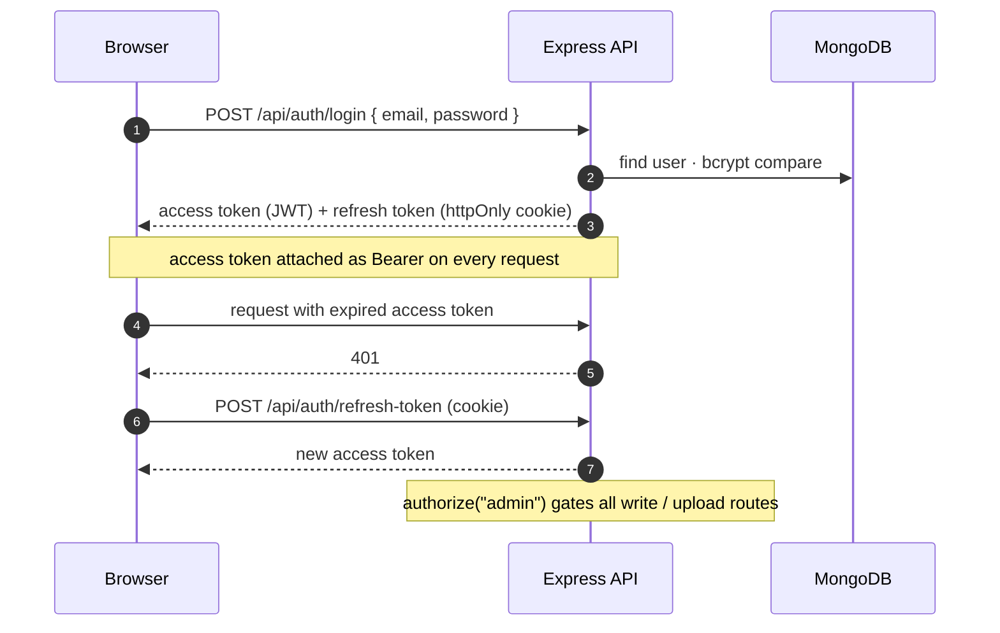

# StreamFlix — Architecture

A Netflix-style video streaming platform. Next.js frontend, Express + MongoDB backend,
and Amazon S3 for media, with direct-to-S3 chunked uploads and a backend streaming proxy.

> All diagrams below are [Mermaid](https://mermaid.js.org/) and render inline on GitHub.

---

## 1. System Overview



**Layering (backend):** `routes → controllers → services → models`. Cross-cutting helpers
live in `utils/` (`s3.js`, `signMovie.js`, token generators) and `middleware/`.

---

## 2. Direct-to-S3 Chunked Upload (admin)

Large video files never pass through the API server. The browser requests presigned URLs,
uploads parts straight to S3 in parallel, then tells the backend to finalize.



**Client details** (`lib/upload.ts`): `CHUNK_SIZE = 10 MB`, `CONCURRENCY = 3`, worker-pool
collects ETags, aborts the whole upload on any part failure. Progress is throttled to
whole-percent changes (`throttleProgress`) to avoid a React setState storm that crashed the tab.
S3 bucket CORS exposes the `ETag` header so the browser can read it back.

---

## 3. Video Streaming (proxy, not presigned)

Playback goes through the API so a long movie can't die mid-stream when a presigned URL expires.

```mermaid
sequenceDiagram
    autonumber
    participant V as "&lt;video&gt; element"
    participant API as Express API
    participant S3 as Amazon S3

    V->>API: GET /api/movies/:id/video<br/>Range: bytes=0-
    API->>S3: GetObject (Range forwarded)
    S3-->>API: 206 Partial Content + bytes
    API-->>V: 206 + Content-Range / Accept-Ranges
    Note over V,API: browser seeks → new Range request → same path
```

`streamMovie` defaults a missing `Range` header to `bytes=0-` (never 400s) and pipes S3's
partial-content response straight back to the `<video>` element.

---

## 4. Media Read Path & Thumbnail Caching

The S3 bucket is **private** — every read URL is a short-lived (1h) presigned GET, signed on
the fly for every list/detail endpoint. Thumbnails are then cached client-side by their stable
S3 key, because the presigned URL signature changes on every response and defeats the HTTP cache.



Key idea: **presigned URL = transport, S3 key = cache identity.** `CachedImage` looks up the
blob by `cacheKey` first, fetches the presigned URL only on a miss, then stores the blob for reuse.

---

## 5. Authentication (JWT access + refresh)



`authenticate` verifies the Bearer JWT; `authorize("admin")` guards every create/publish/upload
route. Public browse endpoints (`/featured`, `/latest`, `/public`, `/public/:id`, `/:id/similar`,
`/:id/video`) need no token.

---

## 6. Request Surface (routes)

| Prefix | Access | Examples |
|---|---|---|
| `/api/auth` | public | `register`, `login`, `refresh-token`, `logout` |
| `/api/users` | authenticated | `profile`, `change-password`, `avatar` |
| `/api/movies` (public) | none | `featured`, `latest`, `genres`, `public`, `public/:id`, `:id/similar`, `:id/video` |
| `/api/movies` (user) | authenticated | `continue`, `progress` |
| `/api/movies` (admin) | `authorize("admin")` | CRUD, `publish`, `feature`, `thumbnail/presign`, `thumbnail/confirm`, `video/initiate`, `video/complete`, `video/abort` |

---

## 7. Tech Stack

| Layer | Tech |
|---|---|
| Frontend | Next.js 16 (Turbopack) · React 19 · TypeScript · TailwindCSS 4 · React Query · axios · react-hook-form + zod · sonner |
| Backend | Node.js (ESM) · Express 5 · Mongoose 9 · JWT · bcrypt · multer |
| Data | MongoDB Atlas |
| Media | Amazon S3 (`eu-north-1`) · presigned URLs · S3 Multipart Upload · `@aws-sdk/s3-request-presigner` |
| Client cache | IndexedDB (thumbnail blobs) |
